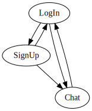
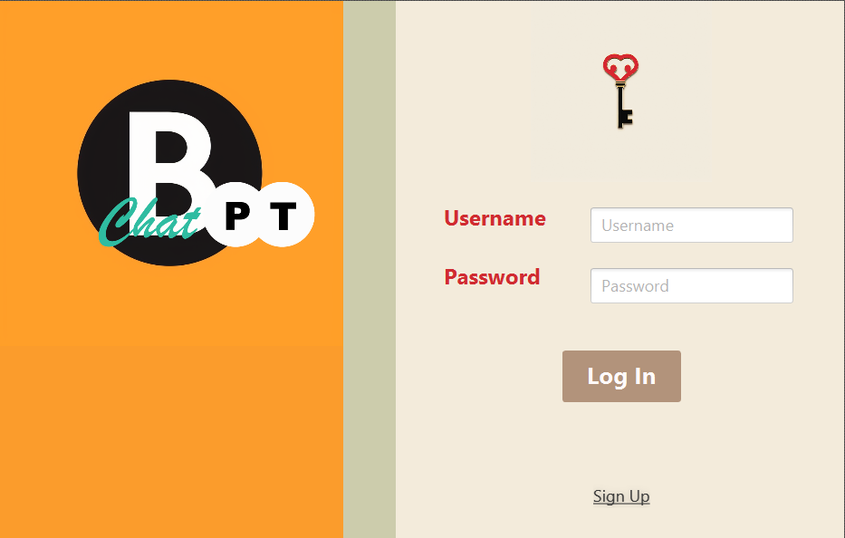
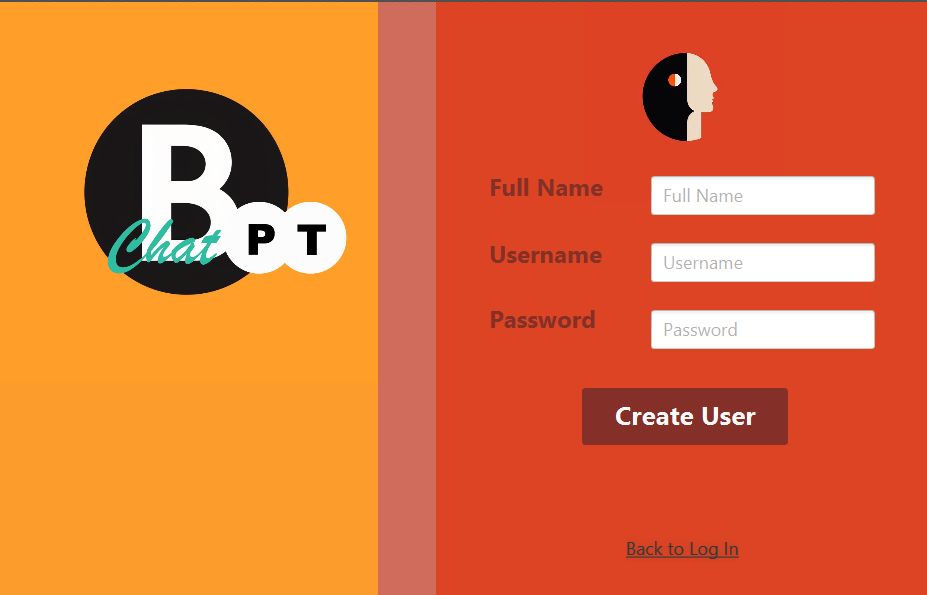

### Lösungsidee/Herangehensweise

Toolwahl:

* Scenebuilder
* Midjourney für Images

Ich dokumentiere das Mockup direkt in Scenebuilder, dazu vorher grundlegen die Idee zum Fluss zwischen den einzelnen Szenen als Graph.

Der Graph stellt die Zusammenhänge der folgenden Controller/FXML-Files dar, die wiederum der ChatBPT-UI-Spezifikation entsprechen.

* LogIn/logIn
* SignUp/signUp
* Chat/chat: fasst erzeugen, beitreten, verbannen (eines Users - Berechtigungskontrolle folgt später dynamisch auf die gleiche Szene), löschen, senden und empfangen (Gruppen- und Privatchat-Funktion), darstellen von Räumen und Nachrichten, darstellen von Verläufen, suchen, anzeigen von Systemnachrichten zusammen, wobei wohl einzelnen Funktionen nur als Button aufrufbar sein werden und die Funktionsweise danach ausgelagert wird.

Chat bezieht Klassen zum Aufbauen sinnvoller Datenstrukturen für die einzelnen Inhalte (User, Nachrichten, Räume) ein, stellt also eine Schnittstelle zwischen UI/Controller und Applikationslogik dar.

Die Main-Klasse ChatBPTApplication beinhaltet eine Methode zum Wechseln zwischen Szenen, aber auch eine zum Neuaufstellen der ganzen Stage (die alte wird verworfen): ein Wechsel zwischen Sign Up und Log In ist für mich etwa Szenenwechsel, aber von Log In bzw. Sign Up nach Chat ist Stagewechsel.

Das Designschema folgt folgenden Entscheidungen in Scenebuilder. Details wie Hover-Effekte, etc. durch Ausführung ersichtlich, ebenso sollte der grundlegen Fluss zwischen den Szenen mit dem Plan zusammenstimmen.

Responsives Design: login und signUp als fixe, einfache und daher nur kleine Fenster implementiert, die Hauptszene Chat als responsiver, komplizierter Anwendungsteil, gemäß der Anfoderung von responsive Design.

### Implementierung/Design

Log In:

Sign Up:

Chat:

### Testung

Als ausführbares Program auf Übereinstimmung mit Flussplan getestet.

Folgender Login ist momentan fest-codiert:

- Username: javacoding
- Password: 123

### Quellen

#### SceneBuilder Tutorials

* https://www.youtube.com/watch?v=VOiFmZyGAps
* https://www.youtube.com/watch?v=HBBtlwGpBek