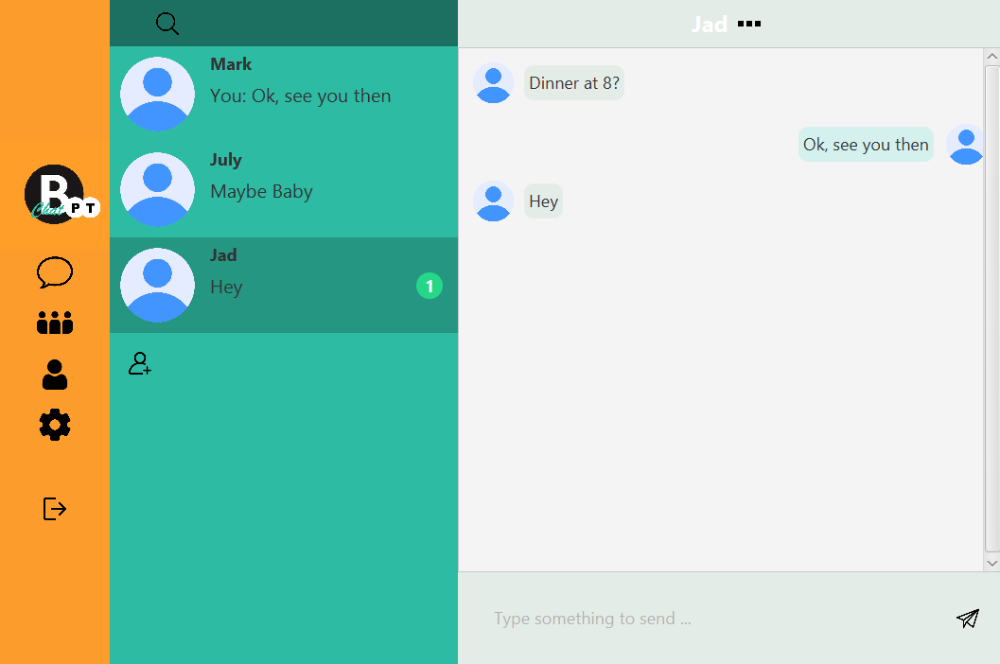
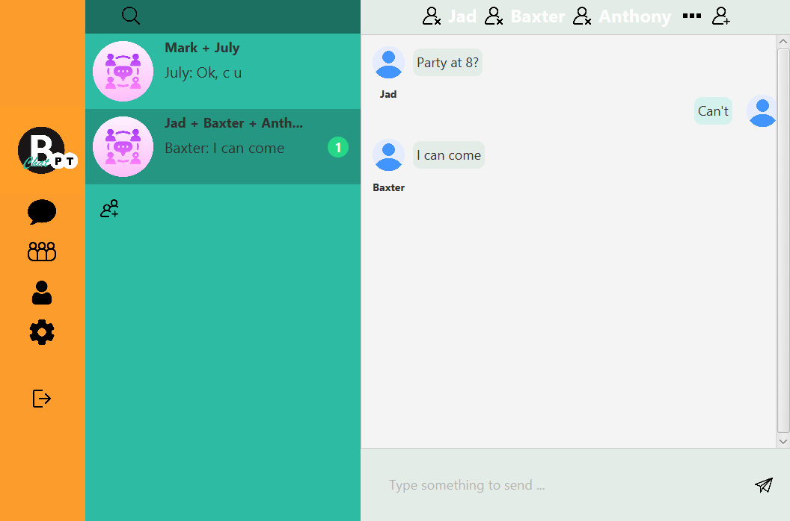
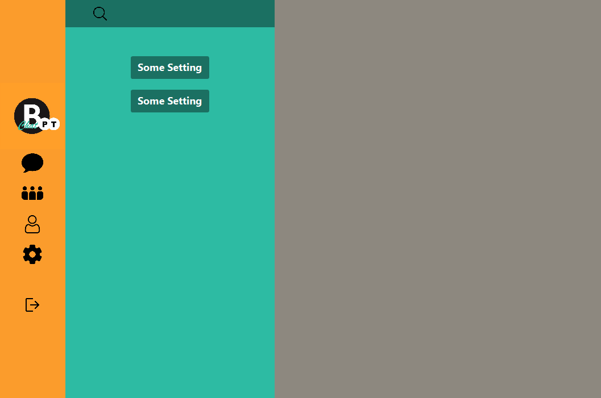
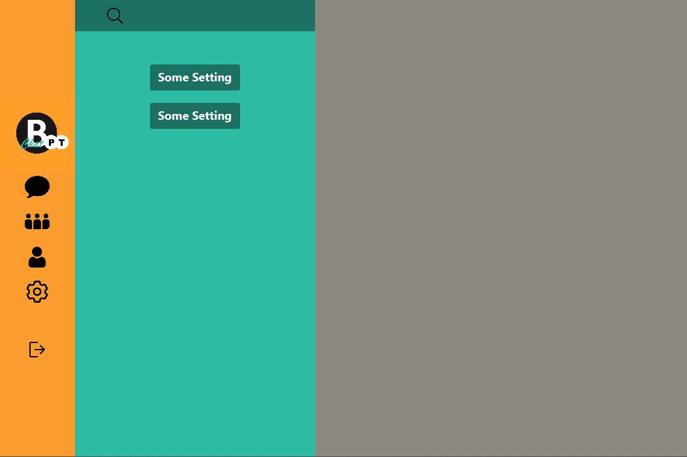

## SWE4 UE5

#### Jack Heseltine, s2110307016, Mai 2023

### Lösungsidee/Herangehensweise

Toolwahl:

* Scenebuilder
* Midjourney für Images

Ich dokumentiere das Mockup direkt in Scenebuilder, dazu vorher grundlegen die Idee zum Fluss zwischen den einzelnen Szenen als Graph (wird im Folgenden erweitert, an der Stelle "Chat").

image::readmeImages/graphviz.svg[]

Der Graph stellt die Zusammenhänge der folgenden Controller/FXML-Files dar, die wiederum der ChatBPT-UI-Spezifikation entsprechen.

* LogIn/logIn
* SignUp/signUp
* Chat/chat: fasst erzeugen, beitreten, verbannen (eines Users - Berechtigungskontrolle folgt später dynamisch auf die gleiche Szene), löschen, senden und empfangen (Gruppen- und Privatchat-Funktion), darstellen von Räumen und Nachrichten, darstellen von Verläufen, suchen, anzeigen von Systemnachrichten zusammen, wobei wohl einzelnen Funktionen nur als Button aufrufbar sein werden und die Funktionsweise danach ausgelagert wird.

Chat bezieht Klassen zum Aufbauen sinnvoller Datenstrukturen für die einzelnen Inhalte (User, Nachrichten, Räume) ein, stellt also eine Schnittstelle zwischen UI/Controller und Applikationslogik dar. Ich habe mich letztlich entschieden, folgende Einteilung der Funktions-"räume" zu machen, als einzelnen Szenen.

* Chat-Teilkomponenten
** Direct-Messaging
** Group-Chats
** User-Einstellungen/Sonstiges
** Anwendungseinstellungen

Im ersten Entwurf in der Oberfläche:

(Über Sign out zurück zur Log In Oberfläche gemäß Zustandsdiagramm.)

Das entspriche m.E. einer sinnvollen Auslagerung der Teilfunktionen gemäß üblicher Chat-Anwendungen.

Die Main-Klasse ChatBPTApplication beinhaltet eine Methode zum Wechseln zwischen Szenen, aber auch eine zum Neuaufstellen der ganzen Stage (die alte wird verworfen): ein Wechsel zwischen Sign Up und Log In ist für mich etwa Szenenwechsel, aber von Log In bzw. Sign Up nach Chat ist Stagewechsel.

Das Designschema folgt folgenden Entscheidungen in Scenebuilder. Details wie Hover-Effekte, etc. durch Ausführung ersichtlich, ebenso sollte der grundlegen Fluss zwischen den Szenen mit dem Plan zusammenstimmen.

Responsives Design: login und signUp als fixe, einfache und daher nur kleine Fenster implementiert, die Hauptszene Chat als responsiver, komplizierter Anwendungsteil, gemäß der Anfoderung von responsive Design.

### Implementierung/Design

Log In:

image::readmeImages/Screenshot 2023-05-22 171505.png[]

Sign Up:

image::readmeImages/Screenshot 2023-05-22 171534.png[]

Chat, Direct Messaging (erster Screen):

Chat, Group Chats:

Chat, User Settings and Customization:

Chat, App Settings and System Messages:

Anmerkungen zum Design: Um Komplexität zu sparen wurde auf Kontextmenüs weitgehend verzichtet. Das Design erinnert an etwas aus den 70ern oder 80ern: diese App hat nicht den Anspruch mit WhatsApp o.ä. zu konkurieren, sonder will einfach sein.

Was den Unterschied zwischen User- und App-Settings betrifft bin ich mir noch nicht sicher, momentan stelle ich mir Profilbild-Einstellung und ähnliches unter User-Settings vor, evtl. in App-Settings die Systemnachrichten.

Was den eingeringelten "1"-er betrifft, um neue Nachrichten zu signlaisieren: das ist eigentlich nicht in den Anforderungen und wird vermutlich wieder gestrichen, im Design nur testweise probiert.

### Testung

Als ausführbares Program auf Übereinstimmung mit Flussplan getestet. Geringe Abweichungen zwischen SceneBuilder MockUp und Programm hinsichtlich Schriftgröße im Chat und Textpositionierung im Chat gefunden. Das Positionieren von Texten z.B. nach Eingabe einer neuen Chat-Nachricht wird aber noch programmatisch angegriffen, daher glaube ich nicht, dass diese Abweichung problematisch ist.

Folgender Login ist momentan fest-codiert:

- Username: javacoding
- Password: 123

### Quellen

#### SceneBuilder Tutorials

* https://www.youtube.com/watch?v=VOiFmZyGAps
* https://www.youtube.com/watch?v=HBBtlwGpBek